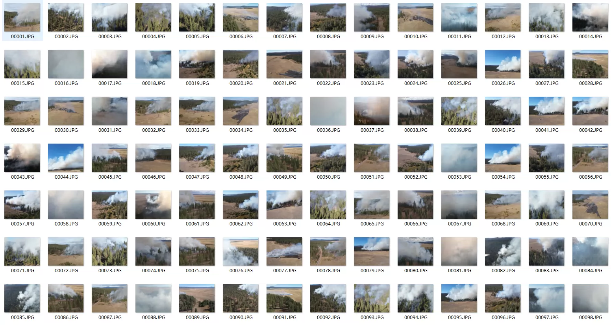
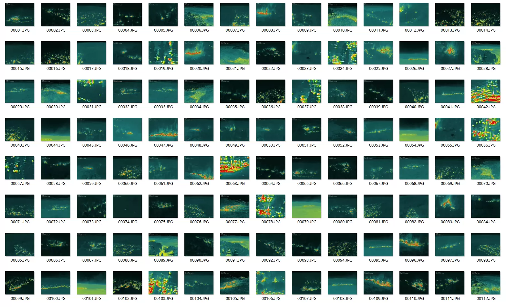
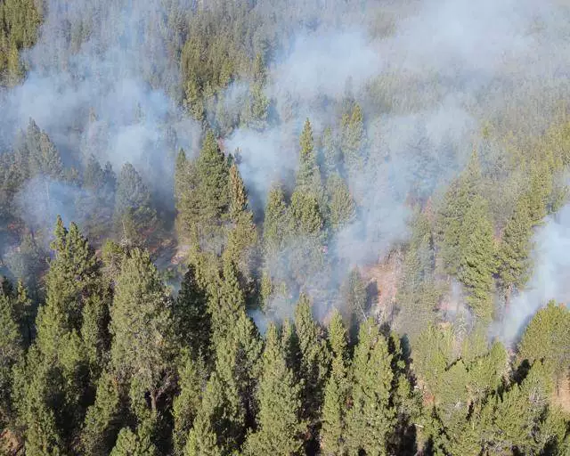
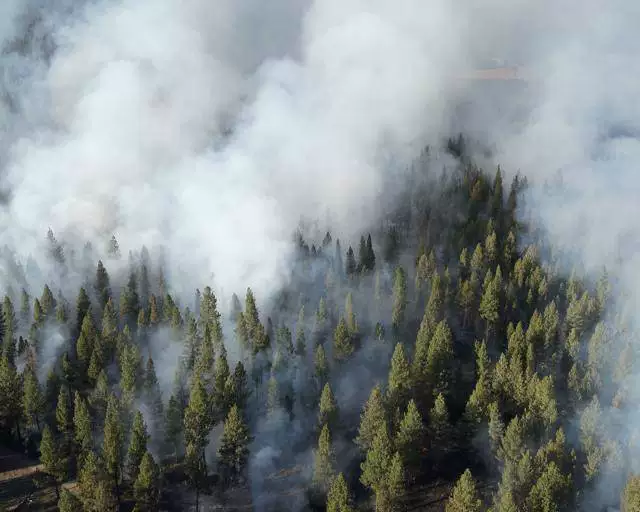
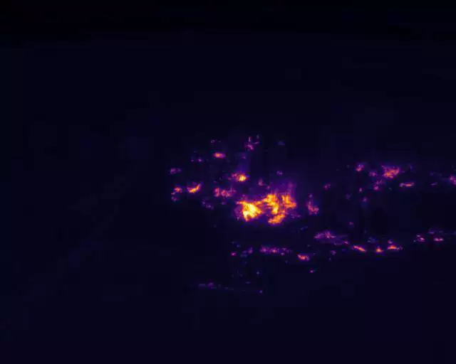
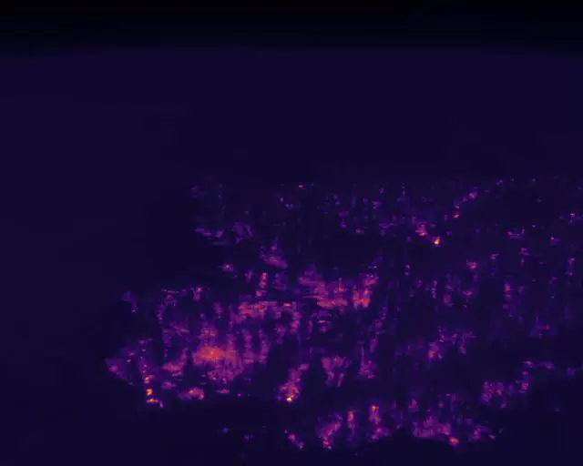

## Body

Fire - Wildfire UAV Multimodal (Visible Light, Thermal Imaging) Dataset with Author's Article

Data Composition:
Coverage Type: Two categories included "with fire" and "without fire" scenes.
Core Scene: The planned burning area of the Sycan Marsh in Oregon and surrounding forests, covering real wildfire scenes and background of no fire forests.

Scene Features: Drone aerial collection, including simultaneous visible light and thermal imaging perspectives, reconstructing real wildfire monitoring scenes, adaptable to computer vision tasks.

Total Image Count: 738 sets of images (total 2952 images), collected by DJI M30T drone.

Data Format: All images are corresponding 6.2G size
fire
-----RGB Visible Light Image Type
-------Corrected FOV Corrected Field of View RGB Image
-------Raw Raw RGB Image
-----Thermal Thermal Imaging Image Category
-------Celsius Tiff Thermal Imaging Temperature Map
-------Raw JPG Raw Thermal Imaging Image

## Images

item_1044828458094

Here is a pay link on Stripe ( https://buy.stripe.com/3cs8yP7sY87d0vu9AB ). Please contact me lonlonago@foxmail.com after funding $89, and I will send you a complete data files , thank you!

